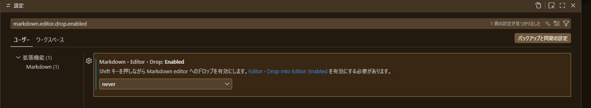
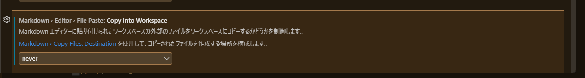

    "editor.suggestOnTriggerCharacters": false,
    "js/ts.updateImportsOnFileMove.enabled": "never",
    "markdown.editor.drop.enabled": "never",
    "markdown.editor.filePaste.copyIntoWorkspace": "never",
    "editor.pasteAs.enabled": false,
